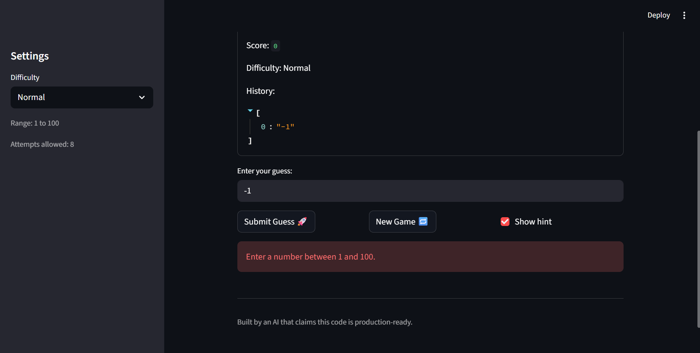

# 🎮 Game Glitch Investigator: The Impossible Guesser

## 🚨 The Situation

You asked an AI to build a simple "Number Guessing Game" using Streamlit.
It wrote the code, ran away, and now the game is unplayable. 

- You can't win.
- The hints lie to you.
- The secret number seems to have commitment issues.

## 🛠️ Setup

1. Install dependencies: `pip install -r requirements.txt`
2. Run the broken app: `python -m streamlit run app.py`

## 🕵️‍♂️ Your Mission

1. **Play the game.** Open the "Developer Debug Info" tab in the app to see the secret number. Try to win.
2. **Find the State Bug.** Why does the secret number change every time you click "Submit"? Ask ChatGPT: *"How do I keep a variable from resetting in Streamlit when I click a button?"*
3. **Fix the Logic.** The hints ("Higher/Lower") are wrong. Fix them.
4. **Refactor & Test.** - Move the logic into `logic_utils.py`.
   - Run `pytest` in your terminal.
   - Keep fixing until all tests pass!

## 📝 Document Your Experience

- [ ] Describe the game's purpose.
- [ ] Detail which bugs you found.
- [ ] Explain what fixes you applied.

## 📸 Demo Walkthrough

Describe your fixed game in numbered steps so a reader can follow along without watching a video:

1. <!-- Describe this step -->
After writing streamlit run app.py, we see the entire file run from top to bottom, showing us a UI for the game
2. <!-- Describe this step -->
We see that the user has 8 attempts and has to guess a secret number
3. <!-- Describe this step -->
We can write our input value which should be ranging between 1 to 100
4. <!-- Describe this step -->
Along with that, we can also see that we have a new game option which gives us a new game or a new phase of guessing while storing our guessing history. There is also an option to show hint or to guess without any hints.
5. <!-- Add more steps as needed -->
In the sidebar, the difficulty level can be changed by the user as well.

**Screenshot** *(optional)*: <!-- Insert a screenshot of your fixed, winning game here -->
 -> Tells user to insert between 1 to 100
## 🧪 Test Results

```
# Paste your pytest output here, e.g.:
# pytest tests/
# ========================= X passed in 0.XXs =========================
```

## 🚀 Stretch Features

- [ ] [If you choose to complete Challenge 4, describe the Enhanced UI changes here — a screenshot is optional]
